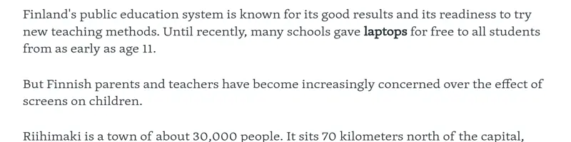
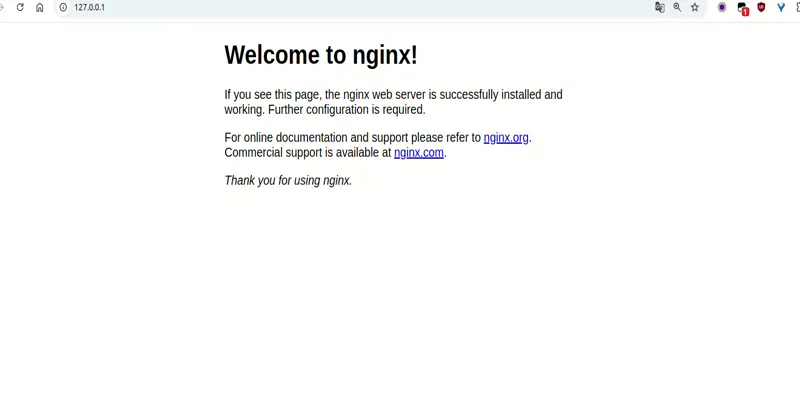
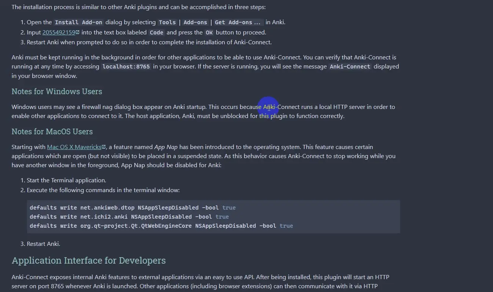

### goldenDict-browser-helper

一个浏览器调用goldenDict或goldenDict-ng的脚本。

虽然本来划词的扩展已经很多了，但感觉还是不如本地多样可定制的mdx词典强大，如果系统装有umi-ocr的话也可以调用，如下图所示。

原理么就是调用goldenDict的快捷键，和umi-ocr的快捷键，不过因为浏览器本身没法是没法直接调用的，就算是装了油猴脚本（扩展不知道），所以用到了go的robotgo库实现，所以除了装了脚本后还得在终端运行go的程序，其实也就是个httpserver,脚本会调用其接口。

ps1: 还加了个用浏览器tts发音，不过不算太好用，不知道为啥句子长了中间就会断掉。

ps2: 这个go的程序还只有在前台执行，~~没法弄成开机自启动使用~~（windows可以），估计涉及到操作系统相关底层的一些问题吧。

ps3: 其实还可以弄些其它骚操作，反正其实就是调些 [快捷键](https://github.com/go-vgo/robotgo/blob/master/docs/keys.md)
而已，就看个人想象了。。。。

#### 查词


什么，因为单词变形所以查不到词？试试鼠标右键点击图标查询试试。

如果默认goldendict快捷键的快捷键为`ctrl c,ctrl c`，会因为本身关联复制系统功能的关系让使用右键查询时导致选中（拖蓝）的文字取消选中。如下有两种方式解决：

- 修改调用goldendict快捷键，再打开tampermonkey高级设置模式，在脚本中的`存储`中添加一个key为`goldDictKey`的值，值为快捷键，如默认值为`ctrl c,ctrl c`，可修改为`alt c,alt c`或者其它,重复按键用半角逗号隔开。

- 使用命令行调用的方式调用goldendict,
在`存储`中添加一个key为`dictCmd`的值，值为goldendict词典的运行程序绝对路径，如`E:\\Program Files\\GoldenDict\\goldendict.exe|-s`，参数用`|`分隔。

#### ocr

得先装umi-ocr,在截图ocr设置中勾选 *复制结果* 并取消勾选 *弹出主窗口*



#### anki制卡

- 可以将词典中词带样式和图片添加到anki中，要使用此功能得在anki里先安装 [ankiconnect](https://ankiweb.net/shared/info/2055492159)
插件，再把`article-script.js`复制到goldendict-ng的配置文本夹（goldendict-ng->帮助->配置文本夹）下，或者将`article-script.js`
的里内容复制到配置文本夹下的`article-script.js`里（如果已有了`article-script.js`的话）。当然也可以不用`article-script.js`，直接在词典里手动ctrl+c复制内容也可以，这个只是这样不能复制出图片
- 可以在编辑器中添加图片，输入图片地址或者base64,并且可以调整图片尺寸
- 添加时自动提取选中词所在的句子，先得在anki中添加一个句子的字段并在添加时设置为这个字段名
  
- 可以查询已添加的卡片
#### 附 windows 后台运行（开机启动）

在**goldenDictHelperServer.exe**目录下创建一个后缀为.vbs的文本文件，添加以下代码

```shell
CreateObject("WScript.Shell").Run "goldenDictHelperServer.exe",0
```

保存退出编辑后，此时双击此文件即可后台运行。

若要开机自启动，鼠标右键上面创建的.vbs文件，创建快捷方式，再**windows+r**输入**shell:startup**回车后会打开一个文件夹，将快捷方式拖入这个文件夹即可。

没想到windows居然可以后台运行，不晓得linux要怎么操作哟。。。。。

### 安装此脚本

[clink here](https://github.com/fthvgb1/goldendict-browser-helper/raw/refs/heads/master/goldenDict-browser-helper.user.js)
由于涉及到要装个后台服务所以没有放到其它脚本托管平台