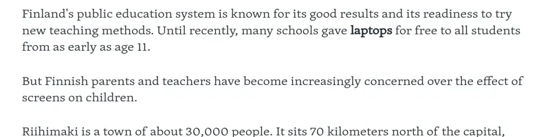
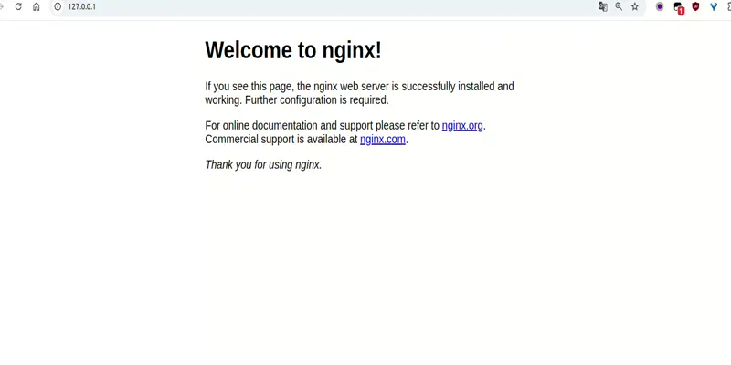
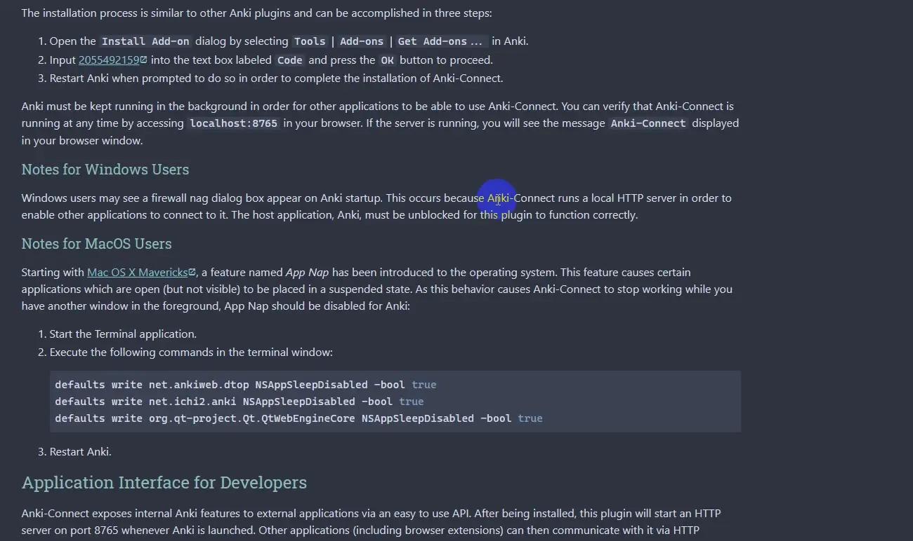

### goldenDict-browser-helper
A browser userscript which can invoke other program or some shortcut keys in system such
as [goldendict-ng](https://github.com/xiaoyifang/goldendict-ng) and a handy Anki card maker.

The browser does not support invoking the outside program or real shortcut keys on its own, the rationale got over this
problem just using some libraries which could control keyboard and clipboard I wrapped it as a web server. So, you can
invoke any short keys by http Api, but it may be identified a virus by antivirus software. Running it or not as you
choose.

### Primary features

#### Invoke Goldendict-ng or other Applications



It should run the server program for invoking other application or tapping any hotkeys

Hint: If you can’t find word due to verb conjugation or noun plurality, try to right-click mouse.

#### TTS

The script can call browser speech synthesis voice Api; you should download the voice pack in all settings ->time &
language ->speech add voice with Windows system. MacOS also can add speech voice, but I not really know how to add in
Linux.

If your system is windows, you can use [NaturalVoiceSAPIAdapter](https://github.com/gexgd0419/NaturalVoiceSAPIAdapter)
to speak with the Microsoft nature voice. It comes info effect in Firefox browser. As to Chrome or other Chromium
browsers or shell application such as anki and so on, ~~I don't know how to be
in force.~~ [check here](https://github.com/gexgd0419/NaturalVoiceSAPIAdapter/issues/5). To put it in a nutshell,
execute follow shell in powershell with administrator access, then restart application.

```shell
Copy-Item HKLM:\SOFTWARE\Microsoft\Speech\Voices\TokenEnums\ HKLM:\SOFTWARE\Microsoft\Speech_OneCore\Voices\ -Recurse
```

#### OCR

First install umi-ocr, then add screenshot OCR and tick copy result. It can be translated when setting the translation
api
in goldendict-ng.

It's need run server program, set the screenshot hotkey to `win+alt+c` and turn `copy result` on in umi-ocr.



#### Anki

When put the scripts in  [goldendict-scripts](goldendict-scripts) into the goldendict-ng’s configure directory and
install [ankiconnect](https://ankiweb.net/shared/info/2055492159) add-ons in Anki. After setting the rules then you
could copy the content of dictionary to the Anki dialog and select deck, model, tag, field and map multiple fields from
the dictionary entry to different fields in their Anki cards. This would enable sending not just the headword and
definition, but also example sentences, phonetic transcriptions (IPA), pictures, grammatical information, and
potentially user-defined fields, to designated fields in Anki.


select and map wordhead, sentence, content of dictionary to Anki's fields.

[](https://github.com/user-attachments/assets/dbba4035-8615-4be8-b4e1-35564cfa7c64)

#### Install script

[click here](https://github.com/fthvgb1/goldendict-browser-helper/raw/refs/heads/master/goldenDict-browser-helper.user.js)

#### Warning

Don't install this project releasing's golang server program in online server. It's not safe.